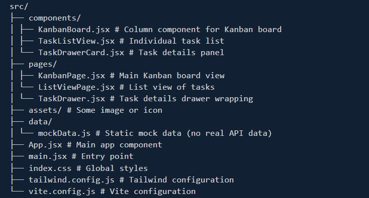

# TaskFlow - Task Management Application

A modern, responsive task management application built with React + Vite and styled with pure Tailwind CSS.

# Live Site Link

- https://react-task-flow-ui.vercel.app

## Features

- **Kanban Board View** - Organize tasks across columns (Backlog, In Progress, Review, Done)
- **List View** - View all tasks in an easy-to-scan list format
- **Eye-Catching Design** - Modern dark theme with gradient accents
- **Fully Responsive** - Works seamlessly on mobile and desktop
- **Pure Tailwind CSS** - No component libraries, no PostCSS config, just raw Tailwind
- **Static Data** - Mock data for demonstration (ready for API integration)

## Tech Stack

- **React** - UI library
- **Vite** - Fast build tool
- **Tailwind CSS** - Utility-first CSS styling
- **JavaScript** - Pure ES6+
- **JSX** - Component syntax

## Project Structure

\`\`\`
src/
├── components/
│ ├── KanbanBoard.jsx # Column component for Kanban board
│ ├── TaskListView.jsx # Individual task list
│ └── TaskDrawerCard.jsx # Task details panel
├── pages/
│ ├── KanbanPage.jsx # Main Kanban board view
│ └── ListViewPage.jsx # List view of tasks
│ └── TaskDrawer.jsx # Task details drawer wrapping
├── assets/ # Some image or icon
├── data/
│ └── mockData.js # Static mock data (no real API data)
├── App.jsx # Main app component
├── main.jsx # Entry point
├── index.css # Global styles
├── tailwind.config.js # Tailwind configuration
└── vite.config.js # Vite configuration
\`\`\`

## Getting Started

1. **Install dependencies:**
   \`\`\`bash
   npm install
   \`\`\`

2. **Start development server:**
   \`\`\`bash
   npm run dev
   \`\`\`

3. **Build for production:**
   \`\`\`bash
   npm run build
   \`\`\`

## Responsive Design

- **Mobile**:

  - Horizontal scrolling for Kanban columns
  - Stacked layout for list items
  - Full-width task drawer

- **Desktop**:
  - Side-by-side layout with task drawer
  - Multi-column Kanban board
  - Optimized spacing and typography

## Customization

All styling uses Tailwind CSS utility classes. Modify `tailwind.config.js` or directly in components using Tailwind class names.

## Notes

- Pure React + Vite (no Next.js, no frameworks)
- No external UI component libraries (no Material UI, Bootstrap, Ant Design, DaisyUI, etc.)
- Pure Tailwind CSS utility classes only
- Mock data ready for API integration
- Fully production-ready code structure
- Zero dependencies beyond React, Vite, and Tailwind CSS
